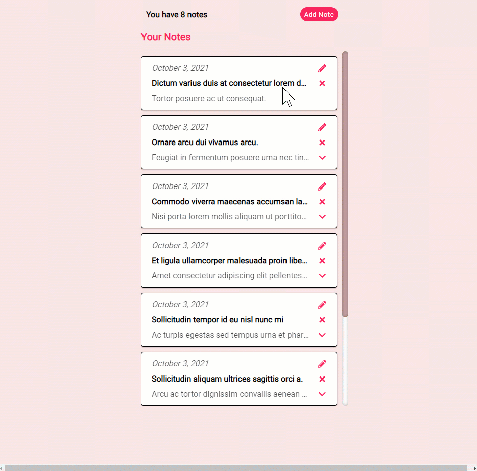

<h1>Notes App </h1>

<h2>Description</h2>
<ul>
  <li>This is a simple notes app that uses React and Express. I made this with the intention to get more familiar with these technologies.</li>
  <li>The user is able to add, update, and delete notes.</li>
</ul>

<h2>GIF</h2>


<h2>Technologies</h2>
Project is created with:
<ul>
  <li>React</li>
  <li>Node.js/Express.js</li>
  <li>MongoDB</li>
</ul>

<h2>Usage</h2>
To start:

First, add MongoDB credentials to config.env then

```
$ npm run dev
```

